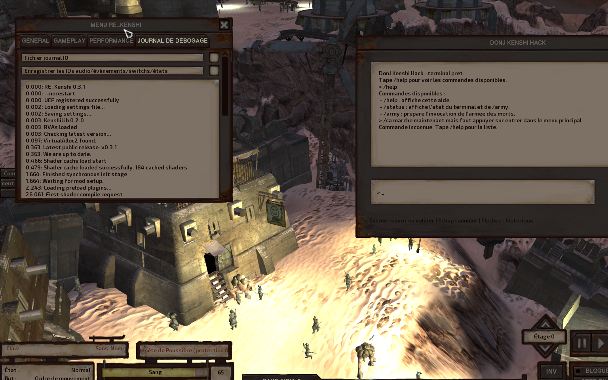

# DonJ Kenshi Hack


Mod **Kenshi Steam** en cours de developpement qui ajoute une fenetre native in-game nommee **`DonJ Kenshi Hack`** avec un terminal de commandes extensible en **C++**.

> [!WARNING]
> **Projet en chantier, actuellement non fonctionnel sur son objectif final.**
>
> Le pipeline complet de la commande **`/army`** est encore **bugue / en cours de debug** et peut encore provoquer des comportements incorrects ou des crashes.
>
> **Ce qui marche deja pour de vrai :**
> - le plugin C++ est charge par **RE_Kenshi**
> - la fenetre **`DonJ Kenshi Hack`** apparait bien en jeu
> - le **terminal in-game fonctionne deja**
> - on peut **creer ses propres commandes en C++** via le registre de commandes
> - les commandes **`/help`** et **`/status`** sont deja operationnelles



*Capture in-game du terminal `DonJ Kenshi Hack` en fonctionnement.*

## Vue d'ensemble

Le projet vise un MVP tres clair :

- ajouter une fenetre UI native dans Kenshi
- fournir un terminal de commandes slash in-game
- permettre d'etendre facilement le mod avec de nouvelles commandes C++
- implementer la commande **`/army`**
- invoquer **30 unites alliees**
- leur donner un comportement **follow + protect**
- les retirer automatiquement apres **180 secondes reelles**

## Etat actuel du projet

### Ce qui est deja en place

- mod de donnees FCS `DonJ_Kenshi_Hack.mod`
- templates FCS :
  - `DonJ_ArmyOfDead_Warrior_A`
  - `DonJ_ArmyOfDead_Warrior_B`
  - `DonJ_ArmyOfDead_Warrior_C`
- plugin natif C++ charge par **RE_Kenshi**
- fenetre in-game **`DonJ Kenshi Hack`**
- terminal MyGUI avec historique + saisie
- commandes `/help`, `/status` et squelette complet de `/army`
- file de commandes executee sur le **game tick**
- session `/army` avec etats, timer, cleanup et reinitialisation
- `SpawnManager` dedie
- `ArmyRuntimeManager` dedie pour :
  - faction
  - positionnement en formation
  - suivi du leader
  - ordres d'escorte
  - dissolution defensive

### Ce qui reste instable

- la materialisation runtime finale des unites via la **factory Kenshi**
- le replay / hook de spawn natif selon le contexte de jeu
- la stabilisation complete de **`/army`**

En bref :

- **le terminal est deja reellement exploitable**
- **l'architecture du mod est serieuse et deja en place**
- **le coeur encore fragile aujourd'hui est le spawn runtime final**

## Architecture retenue

Le projet suit volontairement une architecture hybride :

- **FCS** : donnees du mod
- **plugin natif C++** : runtime in-game
- **RE_Kenshi / KenshiLib** : chargement et hooks
- **MyGUI** : fenetre, historique et saisie terminal
- **C# / OpenConstructionSet** : outillage optionnel uniquement

Ce n'est **pas** un simple mod FCS.

## Arborescence utile

Les dossiers importants du depot :

- `plugin/DonJ_Kenshi_Hack/`
  - code source du plugin
- `package/DonJ_Kenshi_Hack/`
  - package du mod pret a copier dans Kenshi
- `tests/`
  - tests natifs C++

Notes utiles :

- dans le workspace de developpement d'origine, une copie de travail du plugin a aussi existe sous `KenshiLib_Examples/DonJ_Kenshi_Hack/`
- pour GitHub, la version source de reference a publier est celle de `plugin/DonJ_Kenshi_Hack/`
- l'outillage local prive utilise pendant le developpement n'est **pas** publie dans ce depot GitHub

## Installation du mod

### Prerequis

- **Kenshi Steam**
- **RE_Kenshi** installe et fonctionnel
- dossier Kenshi typique :
  - `C:\Program Files (x86)\Steam\steamapps\common\Kenshi`

### Installation rapide

1. Copier le dossier `package/DonJ_Kenshi_Hack/`
2. Le placer dans `Kenshi/mods/DonJ_Kenshi_Hack/`
3. Verifier que le dossier final contient bien :
   - `DonJ_Kenshi_Hack.mod`
   - `RE_Kenshi.json`
   - `DonJ_Kenshi_Hack.dll`
4. Lancer Kenshi
5. Ouvrir l'onglet **Mods**
6. Activer `DonJ_Kenshi_Hack`
7. Arriver au menu principal puis lancer une partie

### Structure attendue dans Kenshi

```text
Kenshi/
\- mods/
   \- DonJ_Kenshi_Hack/
      |- DonJ_Kenshi_Hack.mod
      |- RE_Kenshi.json
      \- DonJ_Kenshi_Hack.dll
```

## Utilisation actuelle

En jeu :

- ouvrir la fenetre `DonJ Kenshi Hack`
- appuyer sur `Entree` pour activer la saisie
- taper une commande slash

Commandes disponibles actuellement :

- `/help`
- `/status`
- `/army`  
  Attention : **encore en cours de debug**

## Comment modifier le mod

### 1. Modifier les donnees FCS

Le mod FCS se trouve dans :

- `package/DonJ_Kenshi_Hack/DonJ_Kenshi_Hack.mod`

Ou, dans l'installation Kenshi :

- `Kenshi/mods/DonJ_Kenshi_Hack/DonJ_Kenshi_Hack.mod`

Pour modifier les donnees :

1. Lancer `forgotten construction set.exe`
2. Charger le mod `DonJ_Kenshi_Hack`
3. Le mettre en `*ACTIVE*`
4. Modifier les templates `DonJ_ArmyOfDead_*`
5. Faire un `Cleanup`
6. Faire un `Scan Errors`
7. Sauvegarder

### 2. Modifier le plugin C++

Le coeur du plugin est dans :

- `plugin/DonJ_Kenshi_Hack/DonJ_Kenshi_Hack.cpp`
- `plugin/DonJ_Kenshi_Hack/TerminalBackend.*`
- `plugin/DonJ_Kenshi_Hack/SpawnManager.*`
- `plugin/DonJ_Kenshi_Hack/ArmyRuntimeManager.*`
- `plugin/DonJ_Kenshi_Hack/ArmyCommandSpec.h`
- `plugin/DonJ_Kenshi_Hack/ArmySession.h`
- `plugin/DonJ_Kenshi_Hack/CommandRegistry.*`

Le terminal est deja concu pour qu'on puisse ajouter facilement de nouvelles commandes C++, par exemple :

- `/heal`
- `/money`
- `/teleport`
- `/godmode`

## Comment recompiler le mod

### Prerequis de build

- Visual Studio 2022 avec la charge de travail **Desktop development with C++**
- dependances KenshiLib
- RE_Kenshi / KenshiLib compatibles avec Kenshi

Le projet s'appuie sur les variables d'environnement suivantes :

- `KENSHILIB_DIR`
- `KENSHILIB_DEPS_DIR`
- `BOOST_INCLUDE_PATH`
- `BOOST_ROOT`

Sur la machine de developpement initiale, elles pointaient vers :

- `C:\Users\nodig\kenshi_donj_hack\KenshiLib_Examples_deps\KenshiLib`
- `C:\Users\nodig\kenshi_donj_hack\KenshiLib_Examples_deps`
- `C:\Users\nodig\kenshi_donj_hack\KenshiLib_Examples_deps\boost_1_60_0`
- `C:\Users\nodig\kenshi_donj_hack\KenshiLib_Examples_deps\boost_1_60_0`

### Build du plugin

Le projet est compile en :

- `Release`
- `x64`

Commande type :

```powershell
cmd /c '"C:\Program Files\Microsoft Visual Studio\2022\Community\Common7\Tools\VsDevCmd.bat" -arch=x64 -host_arch=x64 && MSBuild "C:\chemin\vers\DonJ_Kenshi_Hack.vcxproj" /t:Build /p:Configuration=Release /p:Platform=x64'
```

Fichier cible genere :

- `plugin/DonJ_Kenshi_Hack/x64/Release/DonJ_Kenshi_Hack.dll`

### Redeploiement du package

Apres compilation :

1. copier la DLL generee dans `package/DonJ_Kenshi_Hack/DonJ_Kenshi_Hack.dll`
2. recopier ensuite le package dans `Kenshi/mods/DonJ_Kenshi_Hack/`

## Lancer les tests

### Tests natifs C++

```powershell
cmd /c '"C:\Program Files\Microsoft Visual Studio\2022\Community\Common7\Tools\VsDevCmd.bat" -arch=x64 -host_arch=x64 && cl /nologo /EHsc /std:c++14 /I C:\chemin\vers\plugin\DonJ_Kenshi_Hack C:\chemin\vers\tests\native_terminal_backend_tests.cpp C:\chemin\vers\plugin\DonJ_Kenshi_Hack\ArmyRuntimeManager.cpp C:\chemin\vers\plugin\DonJ_Kenshi_Hack\CommandRegistry.cpp C:\chemin\vers\plugin\DonJ_Kenshi_Hack\SpawnManager.cpp C:\chemin\vers\plugin\DonJ_Kenshi_Hack\TerminalBackend.cpp /Fe:C:\chemin\vers\tests\native_terminal_backend_tests.exe && C:\chemin\vers\tests\native_terminal_backend_tests.exe'
```

## Protocole de test recommande

Ordre de validation conseille :

1. verifier que le plugin charge
2. verifier que la fenetre s'affiche
3. verifier que le terminal repond
4. tester `/help`
5. tester `/status`
6. tester `/army` progressivement en zone peuplee
7. verifier le timer
8. verifier le cleanup
9. verifier qu'une nouvelle session peut repartir proprement

Pendant les tests de spawn, il est recommande de se placer **pres d'une zone peuplee**.

## Aider au debug

Si tu veux aider a trouver les bugs :

- regarde le pipeline `/army`
- teste en partie chargee, pas seulement au menu
- surveille les crashes, les non-spawns et les blocages
- lis les traces dans :
  - `RE_Kenshi_log.txt`
  - `save.log`
  - `kenshi_info.log`

## Statut public du depot

Ce depot est publie pour :

- montrer l'etat reel du chantier
- partager une base de travail propre
- permettre a d'autres personnes de relire le code
- faciliter le debug des points encore sensibles

Le projet avance, mais il faut le lire comme un **WIP technique serieux**, pas comme une release finale.
